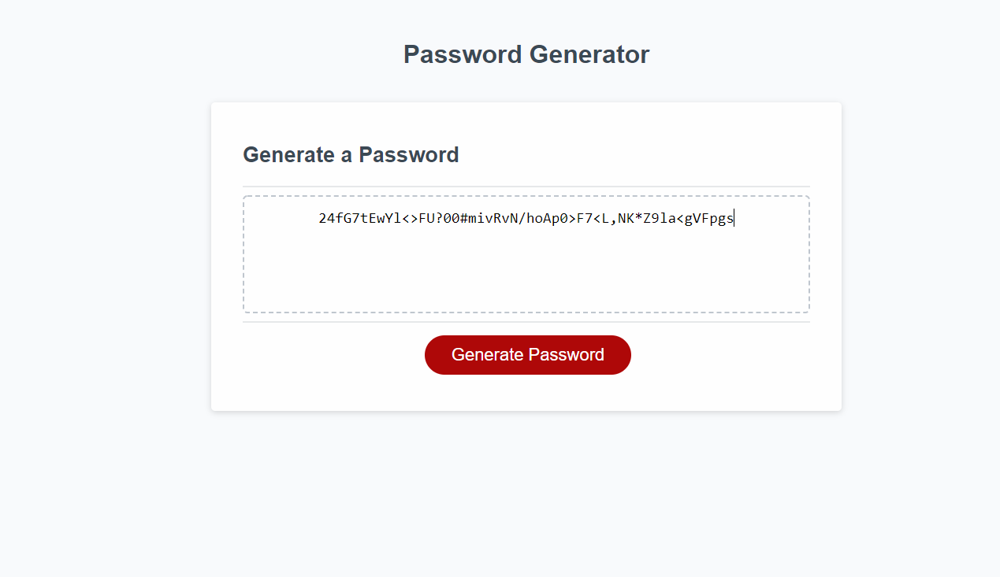

# Homework 3: PASSWORD GENERATOR
Generating unique secured password

## Overview
When the page is open, series of promps appears when hit the Generate Password button including all the criteria like the required password length which is 8 to 128 characters, include atleast one character of: uppercase letters, lowercase letters, numbers and symbols. Once all the valid answers are selected, a secured password is generated and displayed on the page.

### Screenshot of the website

#### Links:
GitHub Repo: https://github.com/prigh-a/Repo_Creating-Password
Web: https://prigh-a.github.io/Repo_Creating-Password/